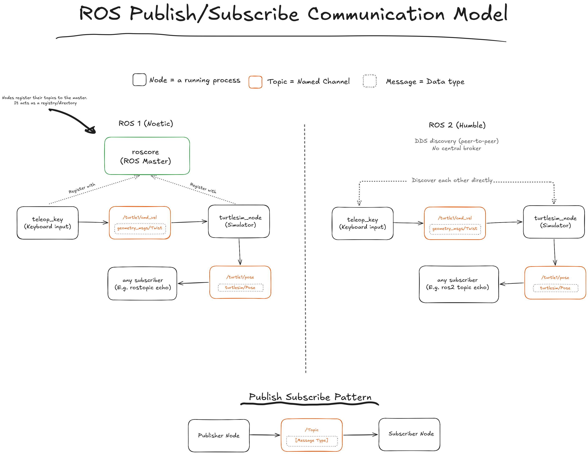

# turtlesim lab

Two independent examples are included:

- **[ros1-noetic-turtlesim/](ros1-noetic-turtlesim/)** — ROS 1 Noetic
- **[ros2-humble-turtlesim/](ros2-humble-turtlesim/)** — ROS 2 Humble

Pick whichever ROS version you're learning (or try both, they don't
conflict, each builds its own image).

## The concept: publish/subscribe communication

Every ROS program is a **node** (a running
process) that talk to each other by publishing and subscribing to
named **topics**, each carrying a typed **message**. `turtle_teleop_key` turns arrow-key presses into `geometry_msgs/Twist` messages on the `/turtle1/cmd_vel` topic; `turtlesim_node` subscribes to that same topic and moves the turtle accordingly, then publishes its own position back out on `/turtle1/pose`. Neither node knows the other exists directly, they only agree on a topic name and a message type.

The one thing that differs between ROS 1 and ROS 2 is *how nodes find
each other* in the first place:

- **ROS 1 (Noetic)** requires a central broker, `roscore` (the ROS
  Master), running first. Every node registers its topics with it, and it acts as a lookup directory so nodes can locate each other. 

- **ROS 2 (Humble)** has no master process. Nodes use DDS discovery to find each other directly, peer-to-peer, over the network. That's why the ROS 2 walkthrough skips straight to launching the simulator.



## How it's organized

Each ROS-version folder has its own `.devcontainer/` with **one
subfolder per host OS**:

```
ros2-humble-turtlesim/
├── docker/
│   └── Dockerfile              # one Dockerfile, shared by all three OS configs
└── .devcontainer/
    ├── linux/devcontainer.json
    ├── macos/devcontainer.json
    └── windows/devcontainer.json
```

All three `devcontainer.json` files build the exact same image. The only
thing that differs between them is how the container's display gets sent
back to your screen (X11 forwarding), because Linux, macOS, and Windows
each handle that differently. When you tell VS Code to reopen a folder in
its container, it detects all three subfolders and asks which one to use —
that's the whole mechanism: **pick the folder matching your OS, everything
else is identical.**

## Prerequisites (all OSes)

1. **Docker**
   - Linux: Docker Engine — run [scripts/host-setup-linux.sh](scripts/host-setup-linux.sh)
     for a one-command install (Ubuntu/Debian), or install manually.
   - macOS / Windows: [Docker Desktop](https://www.docker.com/products/docker-desktop/).
2. **VS Code** + the **Dev Containers** extension
   ([`ms-vscode-remote.remote-containers`](https://marketplace.visualstudio.com/items?itemName=ms-vscode-remote.remote-containers)).
3. **X11 / GUI forwarding**, so the turtlesim window can reach your screen.
   This is the one step that's genuinely different per OS — follow
   **[docs/x11-setup.md](docs/x11-setup.md)** for Linux, macOS, or Windows
   (Windows uses XLaunch, part of VcXsrv).

## Quick start

1. Do the prerequisites above once per machine.
2. Open **either** `ros1-noetic-turtlesim/` or `ros2-humble-turtlesim/` as
   a folder in VS Code (not the whole `turtlesim-devcontainer-tutorial/`
   repo root — each example is its own self-contained folder).
3. **Dev Containers: Reopen in Container**, pick your OS's config.
4. Follow that folder's README to run turtlesim + keyboard teleop.

## Troubleshooting

- **No GUI window appears** — 95% of the time this is the host-side X11
  setup, not Docker or ROS. Re-check [docs/x11-setup.md](docs/x11-setup.md)
  for your OS; on Windows, confirm VcXsrv is actually running (tray icon)
  and "Disable access control" was checked in XLaunch.
- **"Reopen in Container" doesn't ask which OS config to use** — make sure
  you opened the ROS-version folder itself (e.g. `ros2-humble-turtlesim/`)
  as the VS Code workspace root, not a parent or child folder.
- **Container builds but `xhost`/`DISPLAY` errors on Linux** — you likely
  skipped `xhost +local:docker`; it needs to be re-run every login session.
- **macOS: window never appears even though XQuartz is running** — confirm
  "Allow connections from network clients" is checked in XQuartz
  Preferences → Security, and that you restarted XQuartz after changing it.